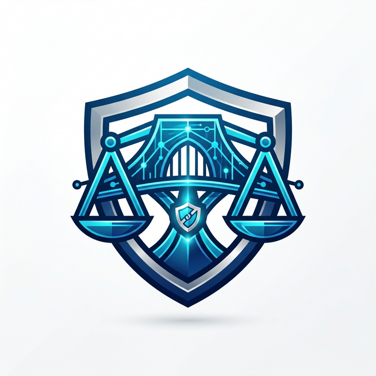
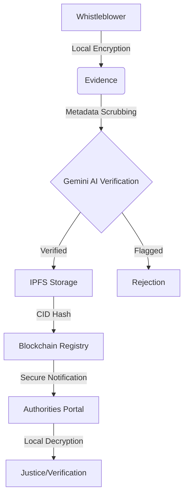

<div align="center">
  
  <h1>NyayaSetu</h1>
  <p><strong>The Whistleblower & Civic Shield Protocol</strong></p>

  [](https://opensource.org/licenses/MIT)
  [](https://gemini.google.com/)
  [](https://ethereum.org/)
  [](https://nextjs.org/)
</div>

---

NyayaSetu is a decentralized, end-to-end encrypted platform designed to protect whistleblowers, journalists, and civic informants when reporting corruption, fraud, or human rights violations to designated authorities. 

By leveraging **Blockchain immutability**, **Zero-Knowledge proofs**, advanced **Hybrid Cryptography**, and **AI-powered Forensic Analysis**, NyayaSetu establishes a zero-trust environment where the identity of the reporter is cryptographically shielded, and the integrity of the evidence is mathematically guaranteed.

## 📖 Table of Contents
- [🎯 The Problem It Solves](#-the-problem-it-solves)
- [✨ Key Features](#-key-features)
- [🏗️ Technical Architecture](#️-technical-architecture)
- [🛠️ Technology Stack](#️-technology-stack)
- [📚 Documentation Index](#-documentation-index)
- [🚀 Getting Started](#-getting-started)
- [🤝 Contributing](#-contributing)
- [📄 License](#-license)

---

## 🎯 The Problem It Solves

Reporting systemic corruption is inherently dangerous. Traditional reporting mechanisms are susceptible to data breaches, insider threats, retroactive tampering, and identity leaks. 

**NyayaSetu solves this by:**
1.  **Ensuring Absolute Anonymity**: Enforcing the use of burner wallets and actively stripping all EXIF/metadata from uploaded evidence before local encryption.
2.  **Preventing Tampering**: Anchoring evidence hashes directly to a Blockchain registry (**CivicChain**). Once submitted, the case record is immutable.
3.  **Validating Authenticity**: Integrating **Google Gemini 2.5 Flash** for advanced forensic AI checks to block AI-generated or tampered evidence.

---

## ✨ Key Features

### 🛡️ For the Whistleblower (Citizen App)
*   **Client-Side Hybrid Cryptography**: Evidence is encrypted locally using AES-256-GCM and the Authority's RSA-2048 Public Key.
*   **Privacy Scrubbing**: Automatic destruction of GPS, timestamps, and hardware IDs from images.
*   **IPFS Integration**: Encrypted payloads are stored on IPFS, removing centralized single points of failure.
*   **Dead Man's Switch**: Cryptographic failsafe that automatically broadcasts evidence if the whistleblower is silenced.

### ⚖️ For the Authorities (Admin/Agency App)
*   **Secure Authority Portal**: Role-Based Access Control (RBAC) via Web3 wallets.
*   **Local Decryption**: Authorities decrypt evidence strictly within their local, secure browser environment.
*   **AI Document Forensics**: Detect LLM-generated wording or structural inconsistencies using Gemini AI.
*   **Transparent Case Management**: Status updates recorded permanently on-chain.

---

## 🏗️ Technical Architecture



---

## 🛠️ Technology Stack

| Component | technologies |
| :--- | :--- |
| **Frontend** |    |
| **Blockchain** |    |
| **AI / Storage** |   |

---

## 📚 Documentation Index

For detailed technical guides, please refer to our documentation Hub:

- 🏛️ **[Architecture Overview](docs/architecture.md)** — Deep dive into the system design and tech stack reach.
- 📜 **[Smart Contracts](docs/contracts.md)** — Security measures, gas optimizations, and contract logic.
- ⚙️ **[Setup Guide](docs/setup-guide.md)** — Comprehensive installation and configuration steps.
- ⛓️ **[Advanced Blockchain](docs/advanced-blockchain.md)** — Insight into CivicChain and ShadowVault protocols.
- 🔄 **[Workflow Guide](docs/workflows.md)** — Step-by-step developer workflows.

---

## 🚀 Getting Started

### 1. Prerequisites
*   Node.js (v18+) & MetaMask Extension.
*   Pinata API Keys & Google Gemini API Key.

### 2. Environment Setup
Copy `.env.example` to `.env` in both root and `NyayaSetu-admin-master` folders:
```env
NEXT_PUBLIC_PINATA_API_KEY="your_key"
NEXT_PUBLIC_PINATA_SECRET_API_KEY="your_secret"
GEMINI_API_KEY="your_gemini_key"
```

### 3. Quick Start (Terminal)

```bash
# Terminal 1: Local Blockchain
cd blockchain && npx hardhat node

# Terminal 2: Deploy Contracts
cd blockchain && npx hardhat run scripts/deploy.cjs --network localhost

# Terminal 3: Citizen App
npm install && npm run dev

# Terminal 4: Admin App
cd NyayaSetu-admin-master && npm install && npm run dev -- -p 3001
```

---

## 🤝 Contributing

We welcome contributions to strengthen digital justice! Please see our [Contributing Guidelines](docs/workflows.md) for more details.

## 📄 License

This project is licensed under the MIT License - see the [LICENSE](LICENSE) file for details.
