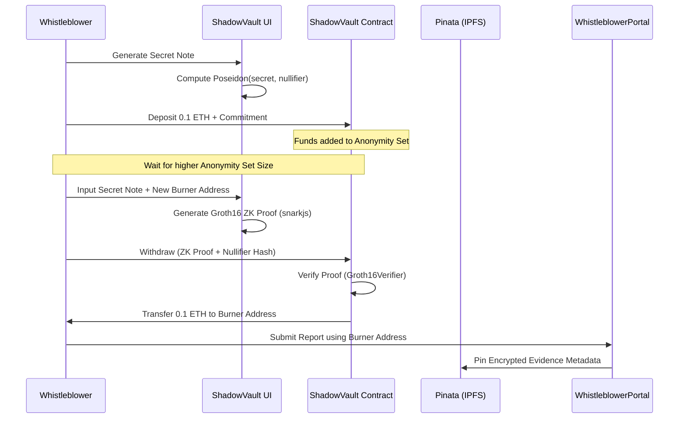
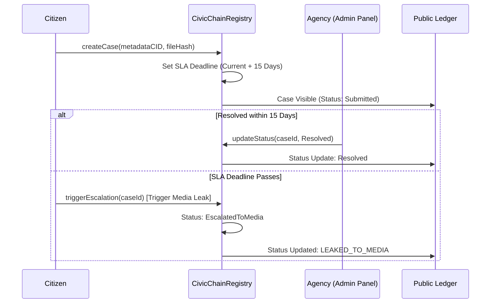

# NyayaSetu Architecture & Technical Flow

NyayaSetu is a decentralized ecosystem that bridges the gap between civic accountability and whistleblower protection through advanced cryptographic protocols.

## 🏛️ System Components & Interaction

The architecture is built on a modular, decentralized foundation where the frontend, backend, and blockchain layers interact as follows:

### 1. Presentation Layer (Frontend & UX)
- **Citizens & Whistleblowers (Port 3000)**: Built with Next.js, this layer focuses on **Account Abstraction (AA)**, using Wagmi hooks to simplify complex cryptographic interactions (like ZK-proof generation) into a human-readable UI.
- **Admin Panel (Port 3001)**: Dedicated interface for agencies to manage and resolve cases with role-based access control (RBAC) enforced on-chain.

### 2. Logic & Scalability Layer (Blockchain & API)
- **State-of-the-Art Smart Contracts**: Solidity-based enforcers for `ShadowVault` (ZK-Mixer), `CivicChainRegistry`, and `DeadManSwitch`.
- **L2-Ready Architecture**: Designed for low-latency, low-cost operations on Ethereum Layer 2s, ensuring the platform can scale as case volume grows.
- **AI Verification API**: An automated layer that verifies evidence authenticity before it’s permanently anchored on-chain.

### 3. Infrastructure & Decentralized Storage
- **Metadata Gateway**: Handles IPFS pinning through Pinata.
- **Verification Service**: Performs AI-driven integrity checks on digital evidence.
- **Immutable Ledger**: Records all case IDs, hashes, and status updates on the blockchain.

---

## 🌊 Technical Flows

### 1. Anonymous Whistleblowing (ZK-Mixer Flow)
The `ShadowVault` utilizes ZK-SNARKs to break the on-chain link between the source of funds and the report submission.

### 2. Civic Complaint & SLA Escalation Flow
The system ensures government accountability by enforcing status updates within a 15-day Service Level Agreement (SLA).

---

## 🌍 Reach & Technology Impact

NyayaSetu is designed for high-impact civic engagement, focusing on four core pillars of technology "reach":

### 1. Transparency Reach (The Ledger)
By recording every civic complaint on an immutable public ledger, the "reach" of a citizen's voice is no longer limited by bureaucratic gatekeepers. The transparency ensures that once a complaint is filed, it exists as a permanent part of the civic record.

### 2. Privacy Reach (The ShadowVault)
The ShadowVault's reach extends to the protection of human rights by providing a mathematically guaranteed privacy layer. Using **ZK-SNARKs**, the system allows users to prove they have the right to submit a report without ever revealing who they are.

### 3. Systematic Reach (The Dead Man's Switch)
The Dead Man's Switch ensures that critical evidence is not lost if the whistleblower is compromised. This technical mechanism shifts the power balance from those who would silence information to the automated, unstoppable execution of smart contracts.

### 4. Verification Reach (AI + IPFS)
By combining **IPFS** for decentralized storage and **AI** for metadata scrubbing, the platform extends the reach of truth. It ensures that evidence is not only stored permanently but is also verified as authentic.

---

## 🔒 Security Architecture
- **In-Browser Proof Generation**: ZK-Proofs are computed locally on the user's device. No secrets ever leave the machine.
- **Asymmetric Key Integration**: The `DeadManSwitch` uses a dual-key model (stored encrypted, released as plaintext) to ensure evidence safety.
- **Role-Based On-Chain Access**: Only agency addresses added by the admin can update case statuses, preventing unauthorized manipulation of the record.
---

## 🛠️ ZK Circuit Setup (ShadowVault)

To enable full cryptographic verification in the `ShadowVault`, the following files must be generated and placed in the `public/circuits/` directory:

- `withdraw.wasm`: The compiled Circom circuit.
- `circuit_final.zkey`: The Groth16 proving key.
- `verification_key.json`: The verification key for on-chain verification.

These can be generated using the setup script located at `blockchain/scripts/setup-circuits.cjs`. Note that until these files are present, the application operates in **DEV_MODE**, where the `Groth16Verifier` contract skips proof validation for easier local testing.
